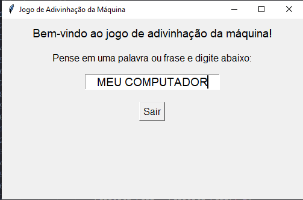
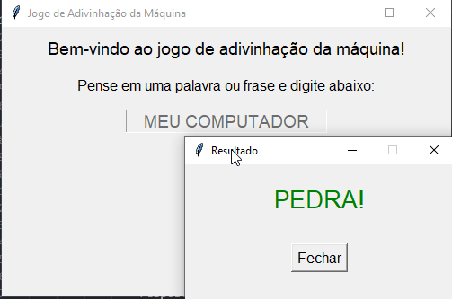

# Jogo de Adivinhação da Máquina

Bem-vindo ao **Jogo de Adivinhação da Máquina**! Este é um jogo interativo desenvolvido em Python com a biblioteca `tkinter`, onde o jogador tenta digitar uma palavra ou frase enquanto a máquina exibe caracteres falsos na tela.

## 📋 Funcionalidades

- **Interatividade com o teclado**: O jogador digita uma palavra ou frase, mas a máquina exibe caracteres falsos no lugar.
- **Limitação de caracteres**: O texto real é limitado a 14 caracteres.
- **Popup de resultado**: Ao pressionar Enter, o jogo exibe a palavra ou frase real digitada.
- **Interface gráfica amigável**: Desenvolvido com `tkinter`, o jogo possui uma interface simples e intuitiva.

## 🛠️ Tecnologias Utilizadas

- **Python**: Linguagem de programação principal.
- **Tkinter**: Biblioteca para criação da interface gráfica.

## 🚀 Como Executar o Projeto

1. Certifique-se de ter o Python instalado em sua máquina. Você pode baixá-lo [aqui](https://www.python.org/downloads/).
2. Clone este repositório ou baixe o arquivo `Adivinhacao_da_Maquina.py`.
3. Abra o terminal e navegue até o diretório onde o arquivo está localizado.
4. Execute o seguinte comando:

   ```bash
   python Adivinhacao_da_Maquina.py
5.A interface gráfica será aberta, e você poderá começar a jogar!
🎮 Como Jogar
    1.Pense em uma palavra ou frase.
    2.Digite no campo de entrada. A máquina exibirá caracteres falsos enquanto você digita.
    3.Pressione Enter para finalizar e ver a palavra ou frase real digitada.
    4.Caso queira apagar um caractere, pressione Backspace.
    5.Para sair do jogo, clique no botão Sair.
📷 Capturas de Tela

### Tela Inicial


### Popup de Resultado


📄 Licença
Este projeto está sob a licença MIT. Sinta-se à vontade para usá-lo e modificá-lo como desejar.

Desenvolvido com ❤️ por Paulo Vitor.